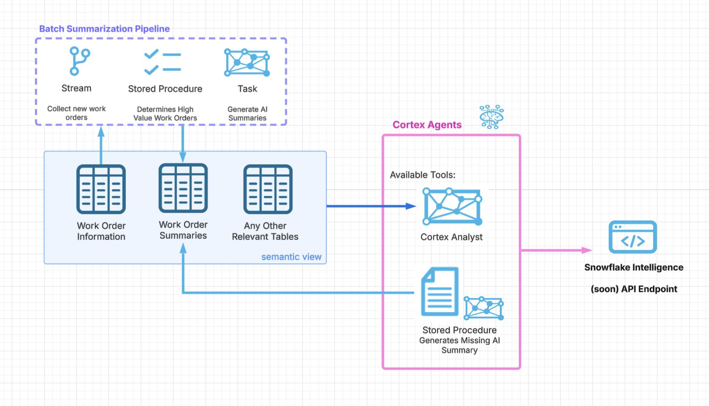

fo# Enterprise Work Order Management with Snowflake Cortex AI

This demo showcases an enterprise-grade work order management system using Snowflake's Cortex AI capabilities, including intelligent agents that can analyze work orders and create AI-generated summaries on demand.

## 🏗️ System Architecture

<div align="center">
  
  <p><em>Complete Enterprise Work Order Management System with Cortex AI</em></p>
</div>

The architecture demonstrates the intelligent orchestration between Cortex Analyst for business intelligence queries and automated summary generation for on-demand AI insights.

## 🎯 What You'll Build

- **Cortex Analyst**: Natural language interface for work order business intelligence
- **Cortex Agent**: Intelligent orchestration that queries existing data and creates summaries when needed
- **Automated Workflows**: Batch and streaming pipelines for enterprise-scale operations

## 📋 Prerequisites

- Snowflake account with Cortex AI features enabled
- Access to Snowsight UI
- Basic familiarity with SQL and Snowflake

## 🚀 Quick Start Guide

Follow these steps in order to set up the complete system:

### Step 1: Run the Setup Script

1. **Execute the setup script** in your Snowflake environment:
   ```sql
   -- Run the entire setup.sql file
   ```
   This creates:
   - Database: `DEMODB`
   - Schema: `WORK_ORDER_MANAGEMENT`
   - Tables: `ENTERPRISE_WORK_ORDERS`, `WORK_ORDER_SUMMARIES`
   - Stage: `ENTERPRISE_DATA_STAGE`
   - Stored Procedure: `CREATE_ENTERPRISE_SUMMARY_IF_MISSING`

### Step 2: Load the Work Order Data

1. **Upload the CSV file** to the stage:
   ```sql
   PUT file://data/enterprise_work_orders.csv @ENTERPRISE_DATA_STAGE/;
   ```

2. **Load the data** into the table:
   ```sql
   COPY INTO ENTERPRISE_WORK_ORDERS 
   FROM @ENTERPRISE_DATA_STAGE/enterprise_work_orders.csv
   FILE_FORMAT = (TYPE = 'CSV' SKIP_HEADER = 1 FIELD_OPTIONALLY_ENCLOSED_BY = '"');
   ```

3. **Verify the data** loaded successfully:
   ```sql
   SELECT COUNT(*) as TOTAL_WORK_ORDERS FROM ENTERPRISE_WORK_ORDERS;
   SELECT * FROM ENTERPRISE_WORK_ORDERS LIMIT 5;
   ```

### Step 3: Upload the Semantic Model

1. **Upload the YAML file** to the stage:
   ```sql
   PUT file://semantic/enterprise_work_orders_analyst.yaml @ENTERPRISE_DATA_STAGE/semantic/;
   ```

2. **Create the semantic view**:
   ```sql
   CALL SYSTEM$CREATE_SEMANTIC_VIEW_FROM_YAML(
       'ENTERPRISE_WORK_ORDER_ANALYST',
       '@ENTERPRISE_DATA_STAGE/semantic/enterprise_work_orders_analyst.yaml'
   );
   ```

3. **Verify the semantic view**:
   ```sql
   SHOW SEMANTIC VIEWS;
   DESCRIBE SEMANTIC VIEW ENTERPRISE_WORK_ORDER_ANALYST;
   ```

### Step 4: Create Cortex Analyst (Snowsight UI)

1. **Open Snowsight** and navigate to **AI & ML > Cortex Analyst**
2. **Click "Create Analyst"**
3. **Select** the `ENTERPRISE_WORK_ORDER_ANALYST` semantic view
4. **Name it**: "Enterprise Work Order Analyst"
5. **Save** and test with questions like:
   - "Show me business information for high-cost work orders"
   - "What work orders have summaries?"
   - "Which facilities have the highest maintenance costs?"

### Step 5: Create Cortex Agent (Snowsight UI)

1. **Navigate to** **AI & ML > Cortex Agents**
2. **Click "Create Agent"**
3. **Name**: "Enterprise Work Order Agent"
4. **Add TWO TOOLS**:
   - **Cortex Analyst**: Select "Enterprise Work Order Analyst"
   - **SQL Tool**: Select procedure `CREATE_ENTERPRISE_SUMMARY_IF_MISSING`

5. **Add Custom Instructions** (copy this exactly):
   ```
   You are an enterprise work order management assistant. Follow this workflow:

   1. ALWAYS start by using the Cortex Analyst to answer user questions about work orders.

   2. If a user asks for a work order summary that doesn't exist:
      - First, inform them the summary doesn't exist
      - Use the CREATE_ENTERPRISE_SUMMARY_IF_MISSING tool to generate it
      - Then use Cortex Analyst again to retrieve the newly created summary

   3. For general work order questions (costs, facilities, equipment, etc.), use Cortex Analyst directly.

   4. Always prioritize using existing data first, then create summaries only when specifically requested or when they don't exist.

   5. Provide business-focused responses that highlight costs, priorities, and strategic implications.
   ```

6. **Save and Test** the complete workflow

## 🧪 Testing the System

### Test the Orchestration Workflow

1. **Ask for general business information**:
   - "What are the most expensive work orders?"
   - "Show me work orders by facility"

2. **Request a summary that doesn't exist**:
   - "Give me a summary for work order [work_order_id]"
   - The agent should: detect no summary → create one → retrieve it

3. **Request an existing summary**:
   - Ask for the same work order summary again
   - The agent should retrieve it directly

## 📊 Data Overview

The system includes **350 realistic work orders** with:
- **Cost Range**: $500 - $150,000
- **Equipment Types**: Pumps, Compressors, Turbines, Generators, Heat Exchangers, etc.
- **Facilities**: 15 manufacturing facilities across different regions
- **Business Metrics**: Impact scores, safety levels, compliance requirements

## 🔧 Additional Enterprise Features

### Automated Batch Processing Pipeline
For automated batch processing of work orders:

- **Pipeline Script**: `streaming_pipeline/streaming_pipeline_improved.sql`
- **Explanation Notebook**: `streaming_pipeline/Enterprise_Streaming_Pipeline_Demo.ipynb`
- **End-to-End Testing**: `streaming_pipeline/test_pipeline_end_to_end.sql`
- **Features**:
   - Snowflake Streams to capture work order changes
   - Snowflake Tasks for automated batch processing weekly (Mondays at 9 AM EST)
   - Processes only high-value work orders (≥$25K) with configurable thresholds
     - Comprehensive testing framework to validate pipeline behavior

## 🎯 Key Business Use Cases

1. **Executive Reporting**: Get instant insights into high-cost maintenance operations
2. **Operational Efficiency**: Identify facilities with highest maintenance costs
3. **Risk Management**: Track critical work orders requiring immediate attention
4. **Compliance Monitoring**: Monitor work orders requiring regulatory compliance
5. **Resource Planning**: Analyze labor hours and contractor requirements

## 📁 Folder Structure

```
Enterprise Demo New/
├── README.md                    # This comprehensive guide
├── setup.sql                    # Complete setup script
├── images/
│   └── architecture.png         # System architecture diagram
├── data/
│   └── enterprise_work_orders.csv    # 20 sample work orders (clean format)
├── semantic/
│   └── enterprise_work_orders_analyst.yaml    # Semantic model with verified queries
└── streaming_pipeline/
    ├── streaming_pipeline_improved.sql       # Complete pipeline (streaming + batch)
    ├── Enterprise_Streaming_Pipeline_Demo.ipynb # Pipeline explanation notebook
    └── test_pipeline_end_to_end.sql          # End-to-end testing script
```

## 🚨 Troubleshooting

### Common Issues

1. **Semantic View Creation Fails**:
   - Verify YAML file uploaded correctly
   - Check database and schema names match

2. **Agent Not Using Tools Correctly**:
   - Ensure Custom Instructions are copied exactly
   - Verify both tools are added and configured

3. **Data Loading Issues**:
   - Check CSV file format and encoding
   - Verify stage permissions

### Getting Help

- Review the setup.sql comments for detailed instructions
- Check Snowflake documentation for Cortex AI features
- Ensure your account has necessary Cortex AI privileges

## 🎉 Success Metrics

You'll know the system is working correctly when:
- ✅ Cortex Analyst answers business questions accurately
- ✅ Agent creates summaries on-demand for work orders without them
- ✅ Agent retrieves existing summaries directly
- ✅ Natural language queries return relevant work order insights

This enterprise demo showcases the power of Snowflake's Cortex AI for intelligent business process automation and decision support. 